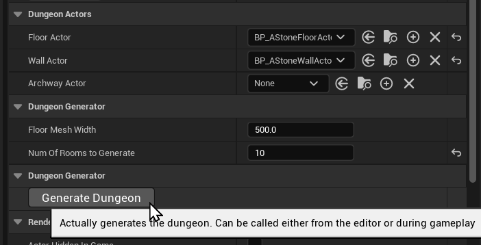
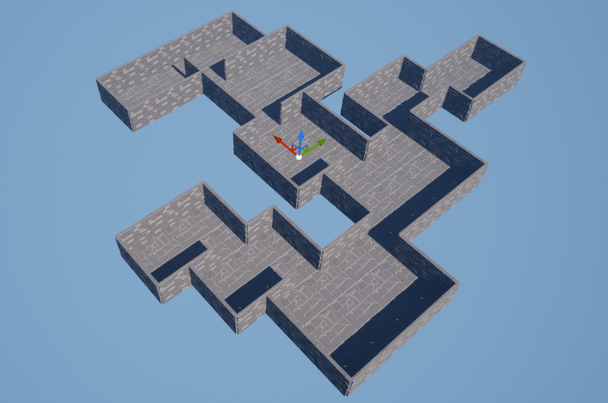
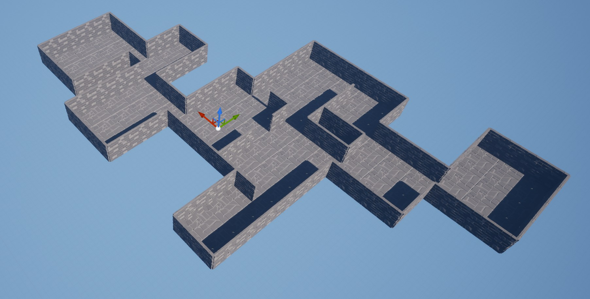

# UE5 Dungeon Generation Tool

This is a dungeon generation tool made in C++ with functionality exposed to the Unreal Engine editor.

The actor will generate a dungeon with a number (user defined) of custom rooms which will all be placed together. The size of the rooms are random, and doorways are generated between each room.

There is a button to generate the dungeon layout in the editor interface, or a generation function can be called at runtime to generate map layouts during gameplay.

